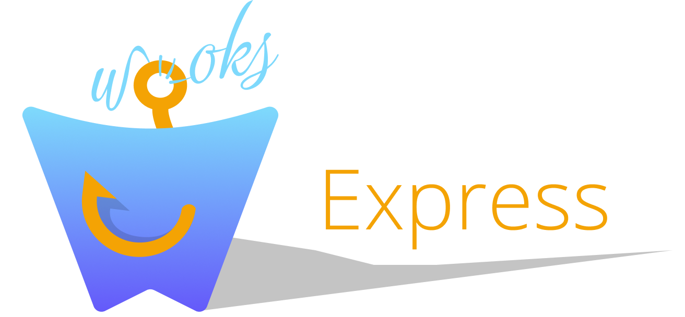

# Express Adapter (Wooks Composables)

**!!! This is work-in-progress library, breaking changes are expected !!!**

<p align="center">
<br>
<a  href="https://github.com/wooksjs/express-adapter/blob/main/LICENSE">
    
</a>
</p>

Want to use [@wooksjs/event-http](https://www.npmjs.com/package/@wooksjs/event-http) but your project is coupled with express? ✅ This is not a problem with this Express Adapter for [wooks](https://www.npmjs.com/package/wooks)

## Install

`npm install @wooksjs/express-adapter @wooksjs/event-http`

## Usage

```ts
import express from 'express'
import { applyExpressAdapter } from '@wooksjs/express-adapter'
import { useBody } from '@wooksjs/http-body'
import { HttpError } from '@wooksjs/event-http'
import { useRouteParams } from '@wooksjs/event-core'

const app = express()

applyExpressAdapter(app)

app.get('/test/:param', () => {
    const { get } = useRouteParams()
    return { message: 'it works', param: get('param') }
})

app.post('/post', () => {
    const { parseBody } = useBody()
    return parseBody()
})

app.get('/error', () => {
    throw new HttpError(400, 'test error')
})

app.listen(3000, () => console.log('listening 3000'))
```
